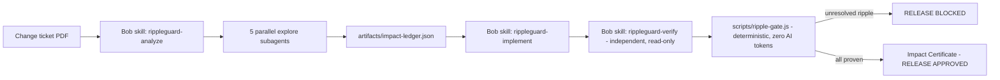

# RippleGuard

**Every legacy change creates a ripple. RippleGuard proves it's safe.**

Built for the IBM TechXchange 2026 Pre-conference Dev Day Hackathon with
**IBM Bob 2.0** as the engine.

## Live demo

The root URL opens the release gate.

| Page | URL |
|---|---|
| Release gate | [https://rippleguard.vercel.app/](https://rippleguard.vercel.app/) |
| How it works | [https://rippleguard.vercel.app/ui/how-it-works.html](https://rippleguard.vercel.app/ui/how-it-works.html) |
| Sessions | [https://rippleguard.vercel.app/ui/bob-sessions.html](https://rippleguard.vercel.app/ui/bob-sessions.html) |
| Pitch | [https://rippleguard.vercel.app/ui/presentation.html](https://rippleguard.vercel.app/ui/presentation.html) |

Direct gate URL: [https://rippleguard.vercel.app/ui/index.html](https://rippleguard.vercel.app/ui/index.html)

## The problem

Developers don't fear changing one line — they fear everything that line
silently affects. In legacy systems, a single field change ripples through
schemas, shared layouts, services, API contracts, batch jobs that read data
by **raw byte position**, partner feed specs, and tests. Miss one consumer
and production silently truncates data. Code search cannot find a consumer
that never mentions the field's name.

## What RippleGuard does

A developer drops a change ticket (PDF). IBM Bob maps every ripple,
implements the change, and a deterministic gate **refuses to ship** until an
independent verification proves every impacted artifact is updated and
tested — or explicitly waived with a logged reason.



**Division of labor by design:** Bob does the reasoning (document
understanding, parallel discovery, implementation, adversarial
verification); plain code does the enforcement (hash-verified, test-backed,
exit-code gate). AI finds the ripples; AI never gets to vouch for itself.

## How IBM Bob 2.0 is the core

| Bob feature | Where it is used |
|---|---|
| Document understanding | Reads `tickets/CHG-1042-customer-id-expansion.pdf` directly |
| Parallel explore subagents | Five domain scouts fan out (`.bob/agents/*.md` personas) |
| Skills | Three-phase workflow: `.bob/skills/rippleguard-{analyze,implement,verify}` |
| Agent mode | Implements the change strictly inside the ledger's blast radius |
| Independent verification | Read-only verifier persona re-derives impact from scratch and may only downgrade statuses |
| Rules & slash command | `.bob/rules/rippleguard.md`, `.bob/commands/rippleguard.md` |

Exported Bob task session reports (required judging evidence) live in
[`bob_sessions/`](bob_sessions/).

## The demo scenario

Ticket **CHG-1042**: expand `CUSTOMER_ID` from CHAR(9) to CHAR(12) and add an
order-status REST endpoint. The seeded legacy app
([`fixtures/order-app/`](fixtures/order-app/)) contains **15 known impacted
artifacts** ([`docs/ground-truth.json`](docs/ground-truth.json)) — including
three that literal code search cannot find:

1. `src/orders/orderService.js` — drift-copy constant under the alias `CUSID`
2. `batch/nightly_billing.js` — anonymous positional offsets (`substring(0, 9)`), documented only in the ops runbook
3. `config/feed-layout.json` — contractual width pinned under the name `CUST_KEY`

Measured on this repo: **grep finds 12/15 (80%)**. RippleGuard's target:
15/15 with line-level evidence, then a red gate on the one consumer left
unresolved, then a green certificate after Bob fixes it.

## Run it (10 minutes, zero dependencies — Node 18+)

```bash
npm test              # fixture test suite
npm run baseline      # snapshot pre-change file hashes
npm run grep-baseline # what literal search finds: 12/15
npm run tickets       # regenerate ticket PDFs from markdown
npm run gate:example  # gate the EXAMPLE ledger -> RELEASE BLOCKED (exit 1)
npm run ui            # serve the Ripple Map at http://localhost:4173
npm run api           # OrderCore API at http://localhost:3000
npm run billing       # run the nightly billing batch job
```

The real `artifacts/impact-ledger.json` is produced by IBM Bob (see
[`docs/BOB-RUNBOOK.md`](docs/BOB-RUNBOOK.md) for the exact task prompts).
`artifacts/impact-ledger.example.json` is a clearly-watermarked stand-in for
developing the UI and gate.

**See the gate refuse to ship (30 seconds):** open
`artifacts/impact-ledger.json`, change any artifact's `"status"` from
`"tested"` to `"open"`, and rerun `node scripts/ripple-gate.js` — the gate
blocks with exit code 1 and the Ripple Map turns red on reload. Restore the
status (or check out the file) and it ships again. The gate is deterministic
code; no AI can talk its way past it.

## Repository map

```
fixtures/order-app/    seeded legacy app (15-artifact ground truth, 3 traps)
tickets/               change ticket, markdown + generated PDF
experiment/            IBM i (RPG/DDS/CL) source Bob also read
.bob/                  skills, agent personas, rules, slash command
scripts/               ripple-gate, baselines, PDF generator, static server
artifacts/             ledger schema, example ledger, gate output, certificate
ui/                    one-screen Ripple Map (reads ui/gate-state.js from the gate)
docs/                  ground truth, Bob runbook, metrics
bob_sessions/          exported Bob task reports + consumption screenshots
```

## Team

Built by a two-person team during the hackathon window (Aug 28-30, 2026).
All AI-assisted analysis, implementation, and verification on the fixture
was performed with IBM Bob on hackathon-provisioned accounts; session
evidence in `bob_sessions/`.
