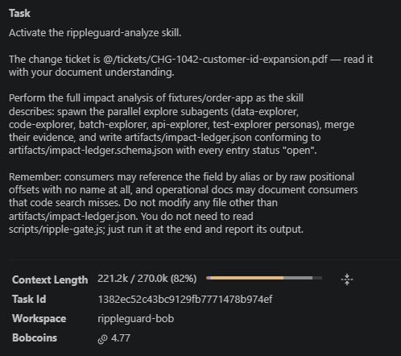
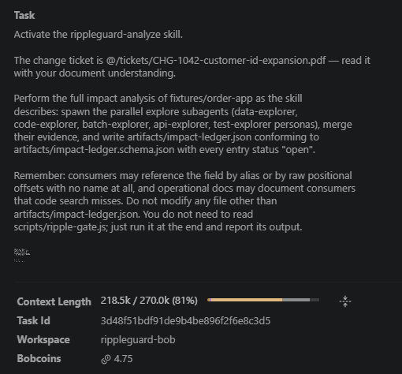
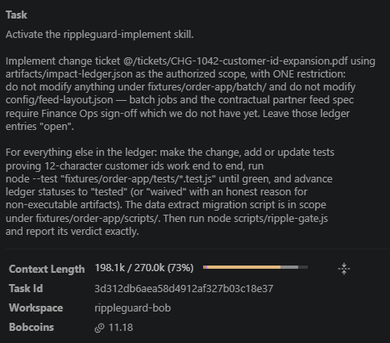
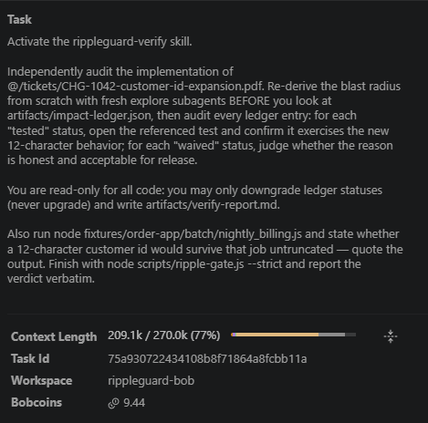
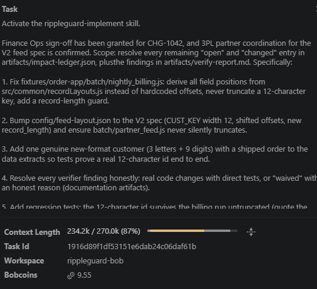

# Metrics — fill during the hackathon, quote in the demo

Rule: only claim numbers this repo can reproduce. The ground truth is
seeded (`docs/ground-truth.json`), so recall claims are reproducible.
Coin spends below are the **Bobcoins** field on each task's
consumption panel (screenshots in `bob_sessions/`). Before/after balances
are derived from the 40-coin hackathon allotment minus those spends.

## Blast-radius recall (auto-generated)

| Method | Found | Recall | Command |
|---|---|---|---|
| Literal grep for `CUSTOMER_ID` | 12/15 | 80% | `npm run grep-baseline` |
| RippleGuard (Bob analyze) | 15/15 | 100% | `node scripts/ripple-gate.js` (recall line) |

Verified on the real hackathon-account run 2026-08-30: Bob found all 15
known-impacted artifacts including the three grep misses, plus two
legitimate extras (the data extracts) — 17 total. Final strict gate:
`RELEASE APPROVED`, exit 0. Evidence audit: 59/60 quotes verbatim.

Artifacts grep misses (the traps):

1. `src/orders/orderService.js` — alias `CUSID`
2. `batch/nightly_billing.js` — anonymous positional offsets
3. `config/feed-layout.json` — spec name `CUST_KEY`

## Bobcoin log (hackathon account)

Starting allotment: **40**. Hard stop was 36; Task 4 hit the ceiling and
the remainder was finished by hand (see disclosure below).

| Task | Phase | Cap | Coins before | Coins after | Spent | Session exported? |
|---|---|---|---|---|---|---|
| 1a | Analyze (run 1) | 8 | 40.00 | 35.23 | **4.77** | [01-analyze-run1.md](../bob_sessions/01-analyze-run1.md) + [coins](../bob_sessions/01-analyze-run1-coins.png) |
| 1b | Analyze (run 2) | 8 | 35.23 | 30.48 | **4.75** | [01-analyze-run2.md](../bob_sessions/01-analyze-run2.md) + [coins](../bob_sessions/01-analyze-run2-coins.png) |
| 2 | Implement (scoped) | 10 | 30.48 | 19.30 | **11.18** | [02-implement.md](../bob_sessions/02-implement.md) + [coins](../bob_sessions/02-implement-coins.png) |
| 3 | Verify | 5 | 19.30 | 9.86 | **9.44** | [03-verify.md](../bob_sessions/03-verify.md) + [coins](../bob_sessions/03-verify-coins.png) |
| 4 | Fix + green ship | 8 | 9.86 | 0.31 | **9.55** | [04-fix-ship.md](../bob_sessions/04-fix-ship.md) + [coins](../bob_sessions/04-fix-ship-coins.png) |
| — | **Total** | 40 allotment | 40.00 | 0.31 | **39.69** | all five panels below |

Task 2, 3, and 4 each exceeded their per-task cap. Two analyze passes
were required: run 1 was 14/15 recall; personas were tightened; run 2
landed 15/15.

### Consumption screenshots (Bob IDE task header)

**Task 1 run 1 — 4.77 Bobcoins** (`01-analyze-run1`, workspace `rippleguard-bob`)

**Task 1 run 2 — 4.75 Bobcoins** (`01-analyze-run2`)

**Task 2 — 11.18 Bobcoins** (`02-implement`)

**Task 3 — 9.44 Bobcoins** (`03-verify`)

**Task 4 — 9.55 Bobcoins** (`04-fix-ship`)

## Time log

Session exports (local timestamps, 2026-08-30):

| Phase | Wall-clock (export) | Notes |
|---|---|---|
| Ticket to full impact ledger | 00:19 (run 1), 00:26 (run 2) | run 1: 14/15; run 2: 15/15 |
| Implement + tests green | 00:41 | 17 tests; 3 ops items left open |
| Verify + red gate | 00:57 | downgraded unearned `tested` |
| Fix + green certificate | 01:12 | budget ceiling; see disclosure |

## Test evidence

| Point | Tests passing | New tests added |
|---|---|---|
| Pre-change baseline | 7 | — |
| After implement (scoped, batch excluded) | 17 | +10 (12-char formats, R2 endpoint, migration) |
| After fix (final, strict gate SHIP) | 34 | +17 (batch regression, genuine 12-char e2e, feed V2, upper boundary) |

Gate progression on the record: analyze → BLOCKED (17 open) → implement →
BLOCKED (3 open, Finance Ops scope) → verify → BLOCKED (4 open, verifier
downgraded 1 unearned "tested") → fix → **RELEASE APPROVED**
(12 tested, 5 waived, 0 open).

## Manual finish disclosure (2026-08-30)

Task 4 hit the 40-coin budget ceiling after all product implementation was
complete (see bob_sessions/04-fix-ship.md for the cutoff point). The
remainder was finished by hand and is disclosed here:

- 4 test assertions fixed for Windows portability: the execSync guard
  tests passed scripts via `node -e "..."` with quote escaping that
  cmd.exe mangles (subprocess exited 0, guards never ran). Switched to
  stdin (`execSync('node', { input: script })`) and removed a
  newline-flattening `.replace()` that commented out one test script.
- Ledger bookkeeping per already-passing tests Bob wrote:
  BATCH_NIGHTLY_BILLING, BATCH_PARTNER_FEED, CONFIG_FEED_LAYOUT advanced
  to "tested" citing billing.test.js / partnerFeed.test.js;
  SVC_CUSTOMER_SERVICE set to "waived" (file identical to baseline by
  design — it consumes the key via the shared modules; behavior proven by
  the 12-char end-to-end tests in routes.test.js).
- No product or source code was hand-written; all implementation is Bob's.

Final state: 34/34 tests, strict gate RELEASE APPROVED, recall 15/15,
evidence 59/60.

## Claims allowed in the video

- "Grep found 12 of 15; RippleGuard found 15 of 15" (reproducible)
- "The gate blocked release on a consumer with no field name in its source"
- Coins and wall-clock from the tables above (39.69 Bobcoins, five exported sessions)

## Claims BANNED in the video

- "100% detection in general" (we measured one seeded scenario)
- Any number not in this file
